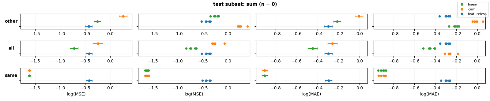

# SOAK: Same/Other/All K-fold Cross-Validation
SOAK is designed to estimate the **similarity of patterns** found across different subsets of a dataset. It extends traditional K-fold cross-validation with "Same," "Other," and "All" splitting strategies to provide a robust measure of pattern similarity.

## Pseudocode
```
FOR each subset of the dataset:
    Split the subset into folds (e.g, 5)

    FOR each test fold:
        Define train sets:
            - "same": data from the current subset (excluding the test fold)
            - "other": data from other subsets
            - "all": combination of "same" and "other"

        FOR each train set in ("same", "other", "all"):
            FOR each model (e.g, featureless, linear, tree, ...):
                The model is trained on the train set and evaluated on the test fold
                Record subset, train set category, fold, model, evaluation metrics (e.g, MSE, MAE)
```

## Usage
### High level
```python
import polars as pl
import lzma
from soak import SOAK

# --- Load dataset from .xz ---
file_path = f"data/'WorkersCompensation'.csv.xz"
with lzma.open(file_path, mode="rb") as f:
    df = pl.read_csv(f, encoding="latin1", infer_schema_length=10000)

# --- Initialize soak object ---
soak_obj = SOAK()

# --- Analyze subset ---
soak_obj.subset_analyze(df, subset_col='Gender', target_col='UltimateIncurredClaimCost', downsample_majority=True, seed=321)

# --- Generate figures ---
figs = soak_obj.plot_results()
```
### Low level
```python
import numpy as np
from soak_low_level import SOAK

# --- synthetic data ---
X = np.arange(8).reshape(-1, 1)
y = X.ravel()
subset_vec = np.array(['even' if x % 2 == 0 else 'odd' for x in X.ravel()])

# --- Initialize soak object ---
soak_obj = SOAK(n_splits=2)

for subset_val, category, fold_id, X_train, X_test, y_train, y_test in soak_obj.split(X, y, subset_vec):
    print(f"subset: {subset_val:6s} --- category: {category:6s} --- fold {fold_id + 1}")
    print("X_train:", X_train.ravel())
    print("X_test: ", X_test.ravel())
    print("-"*50)
```
```
subset: even   --- category: same  
X_train: [2 4]
X_test:  [0 6]
--------------------------------------------------
subset: even   --- category: other 
X_train: [1 3 5 7]
X_test:  [0 6]
--------------------------------------------------
subset: even   --- category: all   
X_train: [2 4 1 3 5 7]
X_test:  [0 6]
--------------------------------------------------
subset: even   --- category: same  
X_train: [0 6]
X_test:  [2 4]
--------------------------------------------------
subset: even   --- category: other 
X_train: [1 3 5 7]
X_test:  [2 4]
--------------------------------------------------
subset: even   --- category: all   
X_train: [0 6 1 3 5 7]
X_test:  [2 4]
--------------------------------------------------
subset: odd    --- category: same  
X_train: [3 5]
X_test:  [1 7]
--------------------------------------------------
subset: odd    --- category: other 
X_train: [0 2 4 6]
X_test:  [1 7]
--------------------------------------------------
subset: odd    --- category: all   
X_train: [3 5 0 2 4 6]
X_test:  [1 7]
--------------------------------------------------
subset: odd    --- category: same  
X_train: [1 7]
X_test:  [3 5]
--------------------------------------------------
subset: odd    --- category: other 
X_train: [0 2 4 6]
X_test:  [3 5]
--------------------------------------------------
subset: odd    --- category: all   
X_train: [1 7 0 2 4 6]
X_test:  [3 5]
--------------------------------------------------
```

## Folder Structure
- **`data`**: Contains all datasets in CSV format. Feature columns has to start with 'X_'
- **`results`**: Contains CSV files of computed errors for each dataset.  
- **`figures`**: Contains figures of errors for each dataset.  
- **`notebooks`**: Jupyter notebooks for testing.

## Figures


## TODO
- Find more regression datasets:
   - source: uci repo or openml
   - having different categories (such as gender)
   - prioritize datasets having many citations
