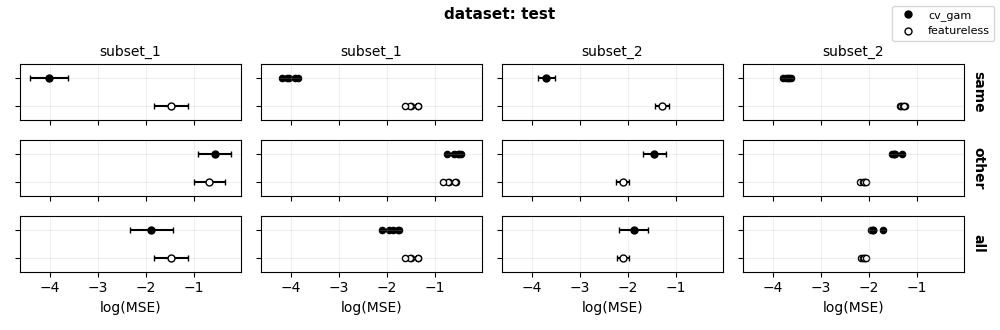

# SOAK: Same/Other/All K-fold Cross-Validation
SOAK is designed to estimate the **similarity of patterns** found across different subsets of a dataset. It extends traditional K-fold cross-validation with "Same," "Other," and "All" splitting strategies to provide a robust measure of pattern similarity.

## Pseudocode
```
FOR each subset of the dataset:
    Split the subset into folds (for example, 5)

    FOR each test fold:
        Define train sets:
            - "same": data from the current subset (excluding the test fold)
            - "other": data from other subsets
            - "all": combination of "same" and "other"

        FOR each train set ("same", "other", "all"):
            FOR each model (featureless and another model):
                The model is trained on the train set and evaluated on the test fold
                Record evaluation metrics (MSE, MAE) along with subset, category (S, O, A), fold, and model
```

## Usage

### 0. Folder Structure
- **`data`**: Contains all datasets in CSV format.  
- **`results`**: Contains CSV files of computed errors for each dataset.  
- **`figures`**: Contains figures of errors for each dataset.  
- **`notebooks`**: Jupyter notebooks for testing.


### 1. Generate Dataset Parameters
Use `params_csv_generator.py` to create the CSV file containing datasets:

```bash 
python params_csv_generator.py
```

### 2. Generate Results
Use `results_generator.py` to generate results for a specific dataset. Replace `i` with the row number from `params.csv`:
```bash
python results_generator.py i
```

### 3. Generate Figures
Use `figs_generator.py` to generate figures for a specific dataset. Replace `i` with the row number from `params.csv`:
```bash
python figs_generator.py i
```

### Notes
Row numbers in `params.csv` start from 0.

## Figures


## TODO
- Find more regression datasets:
   - source: uci repo or openml
   - having different categories (such as gender)
   - prioritize datasets having many citations
